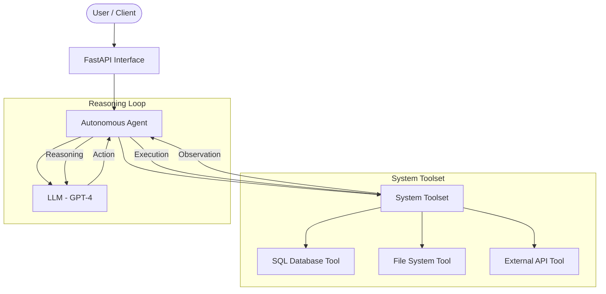
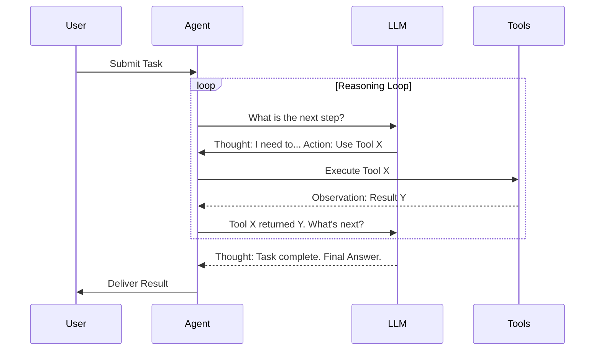

# Intelligent Automation Agent Framework

An enterprise-grade, highly modular framework for building autonomous agents capable of multi-step reasoning, system integration, and operational task execution.

## 🚀 Overview

The Intelligent Automation Agent Framework is designed for technical specialists and AI engineers who need to deploy robust, reliable, and scalable automation solutions. It leverages LangChain for orchestration and OpenAI's GPT models for reasoning, providing a sophisticated ReAct-based execution model.

### Key Features

- **Autonomous Multi-Step Reasoning:** Agents that break down complex tasks into sequential, manageable steps.
- **Enterprise System Integration:** Seamless interaction with SQL databases, local/cloud file systems, and external APIs via a modular toolset.
- **RESTful API Interface:** A production-ready FastAPI layer for triggering, monitoring, and managing automation tasks.
- **Robust Design Patterns:** Implementation follows Strategy and Factory patterns for maximum extensibility.
- **Strict Type Hinting:** Python 3.10+ type safety and Pydantic validation.

## 🏗️ Architecture

The framework is structured into distinct layers to ensure separation of concerns and maintainability.



## 🛠️ Repository Structure

```
Intelligent-Automation-Agent-Framework/
├── api/
│   └── fastapi_interface.py   # REST API layer
├── core/
│   ├── agents/
│   │   └── autonomous_agent.py # Agent logic & LangChain orchestration
│   └── tools/
│       └── system_integrator.py # Multi-system tool implementations
├── tests/
│   └── test_agent_reasoning.py # Pytest suite for validation
├── requirements.txt           # Production dependencies
├── .gitignore                # Standard AI/Python exclusions
└── README.md                  # System documentation
```

## 📋 Getting Started

### Prerequisites

- Python 3.10+
- OpenAI API Key

### Installation

1. Clone the repository:
   ```bash
   git clone <repository-url>
   cd Intelligent-Automation-Agent-Framework
   ```

2. Install dependencies:
   ```bash
   pip install -r requirements.txt
   ```

3. Configure environment variables:
   Create a `.env` file in the root directory:
   ```env
   OPENAI_API_KEY=your_api_key_here
   ```

### Running the API

```bash
python api/fastapi_interface.py
```
The API will be available at `http://localhost:8000`. You can access the interactive documentation at `http://localhost:8000/docs`.

## 🤖 Agentic Workflow

The agent follows a ReAct (Reason + Act) loop, ensuring every action is preceded by logical planning.



## 🧪 Testing

Run the test suite using `pytest`:

```bash
pytest tests/test_agent_reasoning.py
```

## ⚖️ License

Proprietary / Enterprise License
